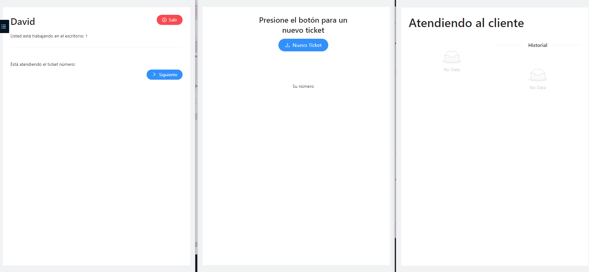

# Aplicación para gestiona una cola de ticket

Front Features: 

- Pantalla para generar nuevos tickets (Usada por los clientes)
- Pantalla para asignar un nuevo ticket a un trabajador (usada por empleados)
- Panel informativo sobre los ticket asignados, el trabajador al en el que esta asginado y el puesto en el que está atendiendo

La comunicación se realiza en tiempo real mediante socket

